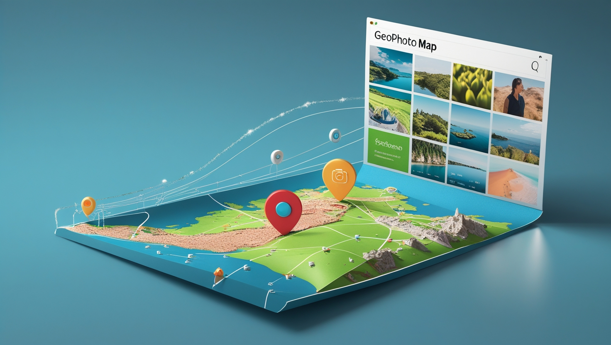

<div align="center">
  
  <h1>📍 GeoPhoto Map 🗺️</h1>
  <p><strong>Transforme suas memórias fotográficas em uma jornada interativa no mapa!</strong></p>
  <p>Este projeto extrai automaticamente as coordenadas GPS de suas fotos e as exibe em um mapa dinâmico e elegante, completo com uma galeria de miniaturas.</p>
</div>

<div align="center">
  
  
  
  
  
  
  
  
</div>

<div align="center">
  
  
  
</div>

<div>
  <p align="center">
    <a href="https://github.com/MagalhaesVini/GeoPhotoMap/releases/download/v1.0.0/GeoPhotoMap.Setup.1.0.0.exe">
      
    </a>
  </p>
</div>


## 📚 Sumário

- [✨ Funcionalidades Incríveis](#-funcionalidades-incríveis)  
- [🎬 Demonstração Rápida](#-demonstração-rápida)  
- [🛠 Tecnologias Utilizadas](#-tecnologias-utilizadas)
- [📂 Estrutura do Projeto](#-estrutura-do-projeto)  
- [⚙️ Pré-requisitos](#-pré-requisitos)  
- [🚀 Como Rodar o Projeto: (Passo a Passo)](#-como-rodar-o-projeto-passo-a-passo)  
- [🔧 Como Funciona a Mágica? (Detalhes Técnicos)](#-como-funciona-a-mágica-detalhes-técnicos)  
- [🤔 Solução de Problemas Comuns](#-solução-de-problemas-comuns)

---

## ✨ Funcionalidades Incríveis

* 📸 **Extração Mágica de Coordenadas:** Lê automaticamente dados GPS (latitude e longitude) de metadados EXIF de suas imagens JPEG.
* 📝 **Organização em CSV:** Salva as informações extraídas (nome do arquivo, latitude, longitude e um snippet HTML da imagem) em um arquivo CSV nomeado com a data atual.
* 🗺️ **Mapa Interativo com Leaflet:** Exibe suas fotos como marcadores em um mapa do Google Maps (camada híbrida), permitindo zoom e navegação.
* 🖼️ **Galeria Charmosa:** Apresenta uma galeria de miniaturas das suas fotos ao lado do mapa. Clicar em uma miniatura centraliza o mapa no local da foto e abre um popup.
* 🎈 **Popups Informativos:** Cada marcador no mapa, ao ser clicado, exibe a imagem e seu nome.
* 🚀 **Servidor Local com Express:** Um servidor Node.js simples para hospedar sua aplicação e visualizar o mapa no navegador.
* 🎨 **Visual Limpo e Responsivo:** Interface agradável e que se adapta bem (embora o foco principal seja desktop).

---


## 🎬 Demonstração Rápida

<div align="center">
  
  <p><em>(1. Imagens na pasta `img`.)</em></p>
  
  <p><em>(2. O script `gerar_csv.js` rodando. 3. O `app.js` rodando. 4. O mapa sendo exibido no navegador com as fotos.)</em></p>
</div>

---

## 🛠 Tecnologias Utilizadas

* **Backend:**
    * Node.js: Ambiente de execução JavaScript.
    * Express.js: Framework web para criar o servidor.
    * `exifr`: Para ler metadados EXIF das imagens (especialmente GPS).
    * `fast-csv`: Para manipulação (leitura e escrita) de arquivos CSV.
    * `fs` (File System): Módulo nativo do Node.js para interagir com o sistema de arquivos.
    * `path`: Módulo nativo do Node.js para lidar com caminhos de arquivos.
* **Frontend:**
    * HTML5: Estrutura da página.
    * CSS3: Estilização.
    * JavaScript (Vanilla): Interatividade no cliente.
    * EJS (Embedded JavaScript templates): Motor de templates para renderizar HTML dinamicamente no servidor.
    * Leaflet: Biblioteca JavaScript para mapas interativos.
    * Google Maps Tiles: Camada de mapa base.
* **Utilitários:**
    * NPM: Gerenciador de pacotes do Node.js.

---

## 📂 Estrutura do Projeto

```
/GeoPhotoMap
│
├── /img                  # Pasta contendo as imagens JPEG georreferenciadas
├── /node_modules         # Dependências instaladas via npm
├── /views                # Templates EJS utilizados na renderização do mapa
│   └── mapa.ejs          # Template principal que exibe o mapa e a galeria
│
├── app.js                # Servidor Express que lê o CSV e exibe o mapa
├── gerar_csv.js          # Script que extrai dados GPS de imagens e gera o CSV
├── coordenadas.csv       # Arquivo CSV com nome, latitude, longitude e HTML das imagens
├── package.json          # Arquivo de configuração do projeto com dependências e scripts
└── package-lock.json     # Versões exatas das dependências instaladas
```

---

## ⚙️ Pré-requisitos

Antes de começar, certifique-se de ter instalado em seu sistema:

- Node.js (versão 14 ou superior)
- npm (gerenciador de pacotes Node.js)

---

## 🚀 Como Rodar o Projeto: (Passo a Passo)

Siga estes passos para ver a mágica acontecer:

<details>
  <summary><strong>1. Clone este Universo (Repositório)</strong></summary>

  Abra seu terminal e execute:

  ```bash
  git clone https://github.com/MagalhaesVini/GeoPhotoMap.git
  cd GeoPhotoMap
  ```

</details>

<details>
  <summary><strong>2. Instale os Artefatos Mágicos (Dependências)</strong></summary>

  No terminal, dentro da pasta do projeto, execute:

  ```bash
  npm install
  ```

  Isso instalará todas as bibliotecas listadas no `package.json`.
</details>

<details>
  <summary><strong>3. Prepare Suas Relíquias (Imagens)</strong></summary>

  - Crie uma pasta chamada `img` na raiz do seu projeto (se ainda não existir).  
  - Copie suas fotos no formato `.jpg` ou `.jpeg` que contenham dados de geolocalização (GPS) para dentro desta pasta `img`.

  📸 Dica: A maioria dos smartphones modernos salva automaticamente as coordenadas GPS nas fotos se a permissão de localização estiver ativa para a câmera.

  Exemplo:

  ```
  GeoPhotoMap/
  ├── img/
  │   ├── foto_praia.jpg
  │   ├── montanha_aventura.jpeg
  │   └── selfie_viagem.jpg
  └── ... (outros arquivos do projeto)
  ```
</details>

<details>
  <summary><strong>4. Convoque o Oráculo (Gerar o CSV)</strong></summary>

  Este passo é crucial! O script `gerar_csv.js` vai ler suas imagens na pasta `img`, extrair as coordenadas e criar um arquivo CSV.

  No terminal, execute:

  ```bash
  node gerar_csv.js
  ```

  Após a execução, você verá mensagens no console:

  ```
  📂 Imagens encontradas na pasta "img": X
  ✅ CSV gerado com sucesso: coordenadas-DD-MM-AAAA.csv
  ```

  ⚠️ **ATENÇÃO IMPORTANTE!** ⚠️  
  O script gera um arquivo chamado `coordenadas-DD-MM-AAAA.csv`, mas o `app.js` espera um arquivo chamado `coordenadas.csv`.

  Portanto, você tem duas opções:

  1. **Renomeie o arquivo gerado**: após rodar `gerar_csv.js`, renomeie o CSV gerado para `coordenadas.csv`.
  2. **OU Modifique o `app.js`**: altere a linha que lê o arquivo para aceitar o nome gerado dinamicamente.

</details>

<details>
  <summary><strong>5. Desperte o Dragão do Mapa (Iniciar o Servidor)</strong></summary>

  Agora que o `coordenadas.csv` está pronto e corretamente nomeado, inicie o servidor:

  ```bash
  node app.js
  ```

  Você verá a mensagem:

  ```
  🗺️ Mapa disponível em: http://localhost:3000
  ```
</details>

<details>
  <summary><strong>6. Explore Seu Mundo (Abrir o Mapa no Navegador)</strong></summary>

  Abra seu navegador e acesse:

  ```
  http://localhost:3000
  ```

  🎉 Parabéns! Você verá um mapa com suas fotos marcadas e uma galeria ao lado.
</details>

---

## 🔧 Como Funciona a Mágica? (Detalhes Técnicos)

### 📜 `gerar_csv.js` - O Coletor de Coordenadas

- **Verifica a pasta `img`**  
- **Filtra imagens `.jpg` ou `.jpeg`**  
- **Extrai dados EXIF com `exifr`**  
- **Gera o CSV com `fast-csv`**  
- **Cria colunas com: nome do arquivo, lat/lon, HTML da imagem**

### 🌐 `app.js` - O Mestre do Mapa

- Inicializa servidor Express  
- Usa `ejs` como template engine  
- Serve pastas estáticas (`img/`, `node_modules/...`)  
- Lê o `coordenadas.csv`  
- Renderiza a view `mapa.ejs` com os dados

### 🗺️ `views/mapa.ejs` - A Tela Mágica

- Divide a tela em mapa e galeria  
- Estiliza com CSS do Leaflet  
- Renderiza miniaturas e marcadores com popups  
- Ao clicar na miniatura, centraliza o mapa e abre o popup

---

## 🤔 Solução de Problemas Comuns

**"Mapa não mostra nenhuma foto" / "Galeria vazia"**

- Verifique se há imagens na pasta `img`
- Certifique-se de que contêm dados GPS (use um visualizador EXIF)
- Confirme que rodou `node gerar_csv.js` após inserir as imagens
- Renomeie corretamente o CSV gerado para `coordenadas.csv`
- Verifique mensagens no console do terminal e no navegador

<details>
  <summary>Erro ao iniciar o servidor: porta já está em uso</summary>

  Certifique-se que nenhuma outra aplicação está usando a porta 3000. Pode mudar a porta no arquivo `app.js` ou matar o processo com:

  ```bash
  npx kill-port 3000
  ```
</details>

<details>
  <summary>As imagens não aparecem no mapa</summary>

  Verifique se o caminho para as imagens está correto e se o arquivo CSV está bem formatado com as colunas corretas (latitude, longitude, nome, url).
</details>

<details>
  <summary>Mapa não carrega os marcadores</summary>

  Confira no console do navegador se há erros de JavaScript. Verifique se os dados estão sendo passados corretamente do backend para o frontend.
</details>

---

<div align="center">
  <p>Feito com ❤️ e muitas xícaras de ☕ por <a href="https://github.com/magalhaesvini">MagalhaesVini</a>.</p>
  <a href="mailto:vinizipi@gmail.com"></a>
  <a href="https://www.linkedin.com/in/magalhaesvinicius/" target="_blank"></a>
</div>
